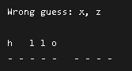
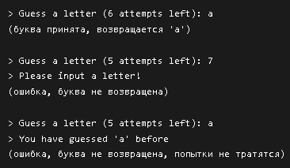

# Консольная игра „Виселица“

## Выводит текущее состояние игры `print_game`
Функция показывает игроку текущую обстановку: какие буквы уже назывались и оказались неверными, как сейчас выглядит угадываемое слово (открытые буквы на своих местах, а скрытые обозначены чёрточками), а также печатает подсказку-линию, чтобы было понятно, сколько букв в слове.

## Загружает список слов из файла и возвращает случайное слово в нижнем регистре `get_rand_word`
Функция загружает список слов из указанного файла. Убирает лишние пробелы и переносы, случайным образом выбирает одно из них и возвращает его в нижнем регистре. 

## Запрашивает у игрока букву `get_letter`
Запрашивает у пользователя букву, проверяет правильнось его ввода (одна буква латинского алфавита) и чтобы не повторялись ранее названные буквы. Если все условия выполнены, то возвращает букву, иначе вернёт ничего не выведет.

## Основной игровой цикл `play`
Функция запускает игру в угадывание слова. В начале даётся 6 попыток, слово скрыто под маской (буквы — подчёркиваниями, пробелы остаются пробелами). Игрок вводит буквы латинского алфавита. Если буква есть в слове — она открывается на всех своих позициях. Если нет — попытка сгорает, а буква запоминается как ошибочная. Повторный или некорректный ввод не наказывается. Игра заканчивается победой, когда открыты все буквы. Если попытки иссякли — проигрыш, и игроку показывают правильный ответ.
